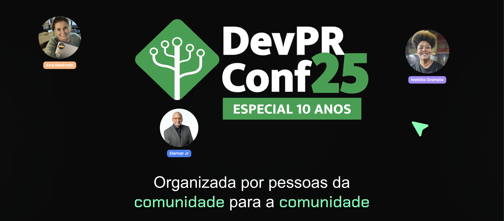
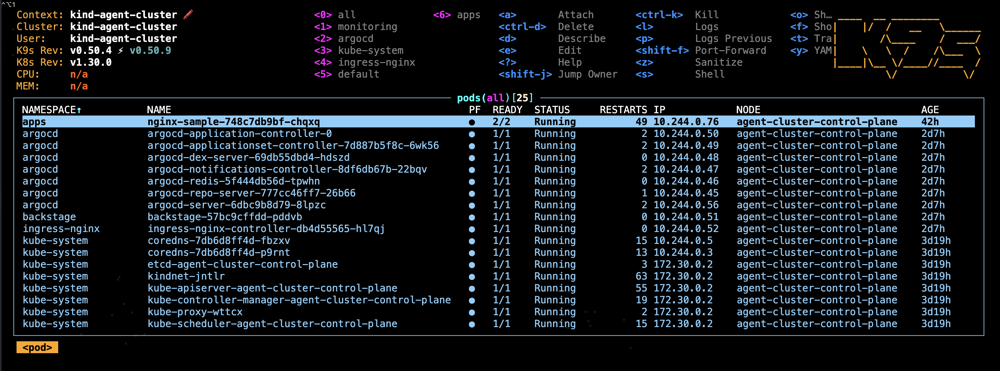
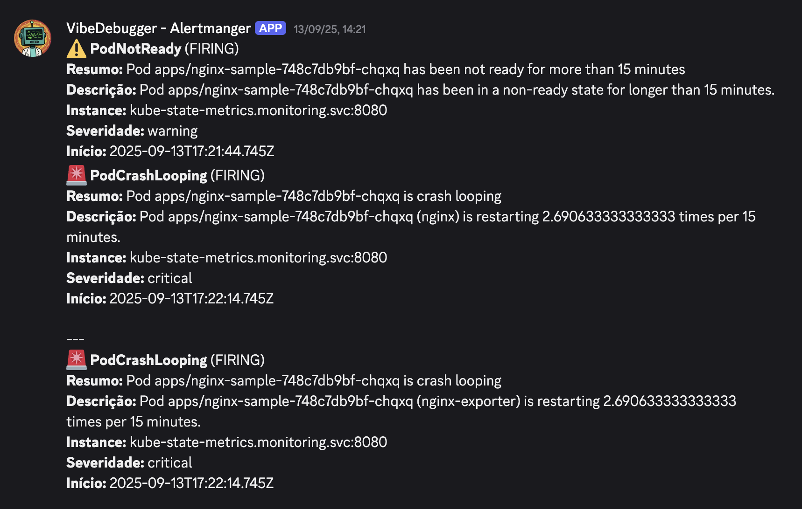
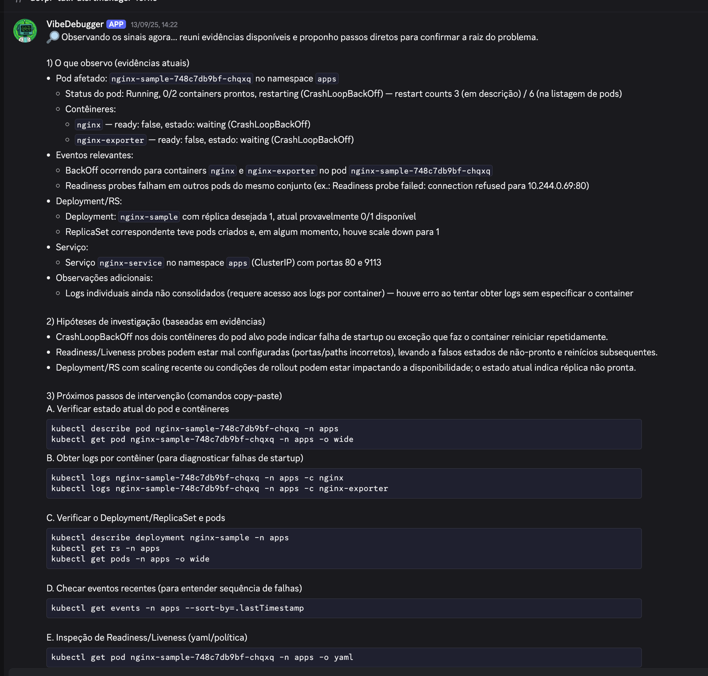
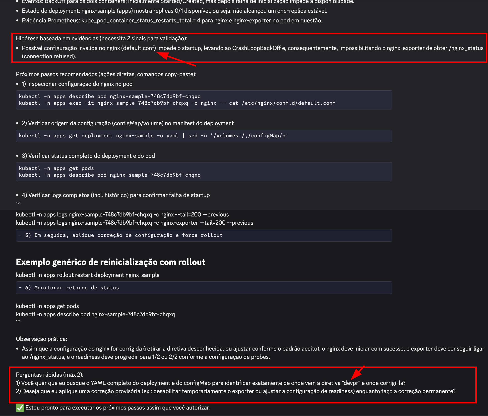

# �� VibeDebugger - Incident Assistant for Oncallers with MCPs

**AI-powered incident response assistant built with LangGraph ReAct agents and Model Context Protocol (MCP) for DevPR 2025 conference.**

<div align="center">
  
</div>

📊 **Presentation:** https://docs.google.com/presentation/d/1caZhQFIXv2K4e1ljIR9I85Xv51vegV3-S64tanx4Q4M/edit?usp=sharing

## 🎯 Quick Start

```bash
# 1. Setup Kubernetes cluster and all services
make setup

# 2. Configure local DNS (requires sudo)
make setup-hosts

# 3. Copy environment variables
cp .env.example .env  # Edit with your tokens

# 4. Install Python dependencies
uv install

# 5. Launch Discord bot
python -m src.vibedebugger_discord.chatbot
```

## 📋 Prerequisites

- **[Docker](https://docs.docker.com/get-docker/)** (v20.10+) - Container runtime
- **[Kind](https://kind.sigs.k8s.io/docs/user/quick-start/#installation)** (v0.20+) - Local Kubernetes clusters
- **[kubectl](https://kubernetes.io/docs/tasks/tools/)** (v1.28+) - Kubernetes CLI
- **[k9s](https://k9scli.io/topics/install/)** (optional) - Terminal UI for Kubernetes
- **[Python](https://www.python.org/downloads/)** (3.10+) - Agent runtime
- **[uv](https://docs.astral.sh/uv/getting-started/installation/)** - Fast Python package manager
- **[Node.js](https://nodejs.org/en/download/)** (v20) via [nvm](https://github.com/nvm-sh/nvm#installing-and-updating) - For Backstage only
- **[Discord Bot Token](https://discord.com/developers/docs/getting-started)** - For chat interface

## 🛠️ Available Commands

### Main Makefile
```bash
make agent PROMPT="Your question"  # Run agent from terminal
```

### Cluster Management (`cluster/Makefile`)

| Command | Description |
|---------|-------------|
| `make setup` | Create Kind cluster with all services (ArgoCD, Prometheus, Grafana, Backstage) |
| `make teardown` | Destroy cluster and cleanup |
| `make setup-hosts` | Configure `*.localdev.me` domains in `/etc/hosts` |
| `make status` | Check health of all components |
| `make validate` | Run validation tests |
| `make port-forward` | Expose all services locally |
| `make get-passwords` | Retrieve admin credentials |
| `make deploy-sample` | Deploy nginx sample app for testing |
| `make logs-<service>` | View logs (argocd/prometheus/grafana/backstage/discord-bot) |

## 📁 Project Structure

```
hello-langrafo/
├── src/                    # Agent source code
│   ├── agent/             # LangGraph ReAct agent core
│   │   ├── graph.py       # Main agent orchestration
│   │   └── constants.py   # System prompts and configurations
│   ├── tools/             # MCP tool implementations  
│   │   ├── k8s.py        # Kubernetes operations
│   │   ├── prometheus.py  # Metrics and alerts
│   │   ├── argocd.py     # GitOps management
│   │   └── backstage.py  # Service catalog
│   ├── mcps/              # MCP server declarations
│   └── vibedebugger_discord/  # Discord bot interface
│       └── chatbot.py     # Bot implementation
├── cluster/               # Kubernetes infrastructure
│   ├── resources/        # K8s manifests
│   │   ├── argocd/      # GitOps deployment configs
│   │   ├── backstage/   # Developer portal
│   │   ├── grafana/     # Dashboards and visualizations  
│   │   ├── prometheus/  # Monitoring and alerting
│   │   └── sample-apps/ # Test applications
│   ├── scripts/         # Automation scripts
│   └── Makefile        # Cluster management commands
├── scripts/              # Helper utilities
│   └── agent_cli.py     # Terminal interface for agent
├── assets/              # Documentation images
├── docker-compose.yml   # Langfuse observability stack
├── langgraph.json      # LangGraph configuration
├── pyproject.toml      # Python dependencies
└── uv.lock            # Locked dependencies
```

## 🚀 Service Access

After `make setup`, services are available at:

| Service | URL | Default Credentials |
|---------|-----|---------------------|
| **ArgoCD** | http://argocd.localdev.me | admin / (run `make get-passwords`) |
| **Backstage** | http://backstage.localdev.me | No auth required |
| **Grafana** | http://grafana.localdev.me | admin / admin |
| **Prometheus** | http://prometheus.localdev.me | No auth required |

> **Note**: Run `make setup-hosts` once to configure local DNS

## 💬 Usage Examples

### Via Discord Bot
1. Configure `.env` with your Discord bot token
2. Run `python -m src.vibedebugger_discord.chatbot`
3. Send messages in Discord channel

### Via Terminal
```bash
# Direct query
make agent PROMPT="Help me investigate nginx-sample in apps namespace"

# Or using the CLI script
python scripts/agent_cli.py "Check pod status in all namespaces"
```

## 🔧 Configuration

Create `.env` file with:
```bash
# Required
OPENAI_API_KEY=sk-...
DISCORD_BOT_TOKEN=...
DISCORD_CHANNEL_ID=...

# Optional (uses defaults)
PROMETHEUS_URL=http://localhost:9090
ARGOCD_SERVER=localhost:8080
BACKSTAGE_URL=http://localhost:7007
```

## 📸 Demonstrations

<details>
<summary>Click to view screenshots</summary>

### K9s Cluster Overview


### Discord Alert from Prometheus


### VibeDebugger Bot Response



</details>

## 🏗️ Architecture

- **ReAct Agent**: Reasoning + Acting loop with LangGraph
- **MCP Tools**: Direct integrations with K8s, Prometheus, ArgoCD, Backstage
- **Local Kind Cluster**: Full observability stack for testing
- **Discord Interface**: Real-time incident response chat

## 📝 License

MIT - See [LICENSE](LICENSE) file for details

## 🤝 Contributing

This project was created for DevPR Conference 2025. Feel free to fork and adapt for your needs!

---
**Built with ❤️ by [Gabriel Dantas](https://gdantas.com.br)**
